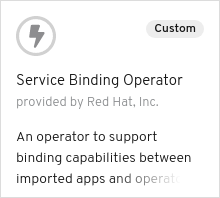
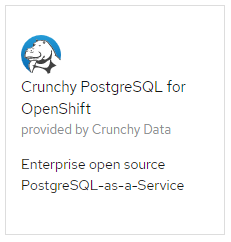

# Binding a Java Microservices JPA app to an In-cluster Operator Managed PostgreSQL Database

## Introduction

This scenario illustrates binding an odo managed Java MicroServices JPA application to an in-cluster operater managed PostgreSQL Database.

## What is odo?

odo is a CLI tool for creating applications on OpenShift and Kubernetes. odo allows developers to concentrate on creating applications without the need to administer a cluster itself. Creating deployment configurations, build configurations, service routes and other OpenShift or Kubernetes elements are all automated by odo.

Before proceeding, please [install the latest v2.0.0-alpha-2 odo CLI](https://odo.dev/docs/installing-odo/)

## Actions to Perform by Users in 2 Roles

In this example there are 2 roles:

* Cluster Admin - Installs the operators to the cluster
* Application Developer - Imports a Java MicroServices JPA application, creates a DB instance, creates a request to bind the application and DB (to connect the DB and the application).

### Cluster Admin

The cluster admin needs to install 2 operators into the cluster:

* Service Binding Operator
* Backing Service Operator

A Backing Service Operator that is "bind-able," in other
words a Backing Service Operator that exposes binding information in secrets, config maps, status, and/or spec
attributes. The Backing Service Operator may represent a database or other services required by
applications. We'll use [Crunchy Data PostgreSQL Operator](https://operatorhub.io/operator/postgresql) to
demonstrate a sample use case.

#### Install the Service Binding Operator

Navigate to the `Operators`->`OperatorHub` in the OpenShift console and in the `Developer Tools` category select the `Service Binding Operator` operator



Alternatively, you can perform the same task manually using the following command:

``` shell
make install-service-binding-operator-community
```

This makes the `ServiceBindingRequest` custom resource available, that the application developer will use later.

##### :bulb: Latest `master` version of the operator

It is also possible to install the latest `master` version of the operator instead of the one from `community-operators`. To enable that an `OperatorSource` has to be installed with the latest `master` version:

``` shell
cat <<EOS | kubectl apply -f -
---
apiVersion: operators.coreos.com/v1
kind: OperatorSource
metadata:
  name: redhat-developer-operators
  namespace: openshift-marketplace
spec:
  type: appregistry
  endpoint: https://quay.io/cnr
  registryNamespace: redhat-developer
EOS
```

Alternatively, you can perform the same task manually using the following command before going to the Operator Hub:

``` shell
make install-service-binding-operator-source-master
```

or running the following command to install the operator completely:

``` shell
make install-service-binding-operator-master
```

#### Install the DB operator

Login to your Openshift terminal for all command line operations

Follow the installations instructions for [Installing Crunchy PostgreSQL for Kubernetes](https://operatorhub.io/operator/postgresql)

When you have completed the `Before You Begin` instructions, you may access your Openshift Console and install the Crunchy PostgreSQL Operator from the Operator Hub:



After the instalation completes via the Operator Hub, please follow the instructions in the `After You Install` section.

### Application Developer

#### Access your Openshift terminal and oc login to the Openshift Cluster

#### Create a namespace called `service-binding-demo` from the pgo CLI
#### What is the pgo CLI?
the pgo cli is a terminal command line interface for the Crunchy PostgreSQL Operator - it allows you to create namespaces and database instances that will be managed by the Crunchy PostgreSQL Operator. Then pgo CLI was installed as part of the Crunchy PostgreSQL installation process that you followed earlier.

The application and the DB needs a namespace to live in so let's create one for them using the pgo CLI:

```shell
pgo create namespace service-binding-demo
```
#### Create a database cluster instance called `my-demo-db` from the pgo CLI

Use the pgo CLI to create a db cluster instance in the namespace you created in the previous command. This instance will be a postgreSQL db managed by the Crunchy PostgreSQL Operator.

```shell
pgo create cluster my-demo-db -n service-binding-demo
```

#### Import the demo Java MicroService JPA application

In this example we will use odo to manage a sample [Java MicroServices JPA application](https://github.com/OpenLiberty/application-stack-samples.git).

From the Openshift terminal, create a project directory `my-sample-jpa-app`

cd to that directory and choosed the namespace we created above for the application:

```shell
> oc project service-binding-demo
```
git clone the sample app repo to this directory.
```shell
> git clone https://github.com/OpenLiberty/application-stack-samples.git
```
cd to the sample JPA app
```shell
> cd ./application-stack-samples/java-openliberty/samples/jpa
```
initialize project using odo
```shell
> odo create
```
Perform an initial odo push of the app to the cluster
```shell
> odo push 
```

Teh application is now deployed to the cluster - you can view the status of the cluster and the application test results by streaming the openshift logs to the terminal

```shell
> odo log
```
Notice the failing tests due to a missing database connection.

```shell
[INFO] Exception Description: Predeployment of PersistenceUnit [jpa-unit] failed.
[INFO] Internal Exception: javax.persistence.PersistenceException: CWWJP0013E: The server cannot locate the jdbc/DefaultDataSource data source for the jpa-unit persistence unit because it has encountered the following exception: javax.naming.NameNotFoundException: Intermediate context does not exist: jdbc/DefaultDataSource.
[INFO] [err] java.lang.NullPointerException
[INFO] [err]    at org.example.app.PersonResource.getAllPeople(PersonResource.java:74)
[INFO] [err]    at org.example.app.PersonResource$Proxy$_$$_WeldClientProxy.getAllPeople(Unknown Source)
[INFO] [err]    at jdk.internal.reflect.GeneratedMethodAccessor537.invoke(Unknown Source)
[INFO] [err]    at java.base/java.lang.reflect.Method.invoke(Method.java:566)
[INFO] [err]    at com.ibm.ws.jaxrs20.cdi.component.JaxRsFactoryImplicitBeanCDICustomizer.serviceInvoke(JaxRsFactoryImplicitBeanCDICustomizer.java:339)
[INFO] [err]    at [internal classes]
[INFO] [err]    at javax.servlet.http.HttpServlet.service(HttpServlet.java:686)
[INFO] [err]    at com.ibm.websphere.jaxrs.server.IBMRestServlet.service(IBMRestServlet.java:96)
[INFO] [err]    at [internal classes]
[INFO] [err]    at java.base/java.util.concurrent.ThreadPoolExecutor.runWorker(ThreadPoolExecutor.java:1128)
[INFO] [err]    at java.base/java.util.concurrent.ThreadPoolExecutor$Worker.run(ThreadPoolExecutor.java:628)
[INFO] [err]    at java.base/java.lang.Thread.run(Thread.java:834)
6590 INFO org.microshed.testing.jaxrs.JsonBProvider  - Response from server: []

```

#### Express an intent to bind the DB and the application

Now, the only thing that remains is to connect the DB and the application. We will use odo to create a link to the Service Binding Operator and will manually configure the resulting Service Binding Request to 'magically' do the connection for us.

Display the services available to odo:
```shell
> odo catalog list services
```

You will see an entry for the Service Binding Operator displayed:

```shell
> odo catalog list services
Operators available in the cluster
NAME                                    CRDs
service-binding-operator.v0.1.1-352     ServiceBindingRequest
>
```
use odo to create an odo service for the Service Binding Operator
```shell
> odo service create service-binding-operator.v0.1.1-352/ServiceBindingRequest
```
push this service instance to the cluster
```shell
> odo push
```
List this service
```shell
> odo service list
NAME                                                                                       AGE
ServiceBindingRequest/example-servicebindingrequest                                        168h18m3s
>
```
Create a Service Binding Request between the application and the database using the Service Binding Operator service created in the previous step

```shell
> odo link ServiceBindingRequest/example-servicebindingrequest
```

push this link to the cluster
```shell
> odo push
```

You have now created a Service Binding Request object called `jpa-servicebindingrequest-example-servicebindingrequest` in the cluster on behalf of your application. We must manually configure the YAML files associated with it and the Custom Resource Object associated with the database in order to link them both together.

You can see this Service Binding Request via kubectl
```shell
> kubectl get servicebindingrequest jpa-servicebindingrequest-example-servicebindingrequest
NAME                                                      AGE
jpa-servicebindingrequest-example-servicebindingrequest   3m12s
>
```
Or, alternatively, you can inspect the SBR via the Openshift console in Administrator view by navigating to Operators > Installed Operators > Service Binding Operator and clicking on the Service Binding Request tab. Select the Service Binding Request Instance named `jpa-servicebindingrequest-example-servicebindingrequest`

#### Manually configure YAML files

Access the Openshift console and navigate to Administration > Custom Resource Definitions > Pgcluster and click on the 'Instances' tab

Click on your db cluster instance name 'my-demo-db'
Edit the YAML and add the following annotations to the annotations block within the meta-data block

```yaml
metadata:
  annotations:
    servicebindingoperator.redhat.io/spec.database: 'binding:env:attribute'
    servicebindingoperator.redhat.io/spec.namespace: 'binding:env:attribute'
    servicebindingoperator.redhat.io/spec.port: 'binding:env:attribute'
    servicebindingoperator.redhat.io/spec.usersecretname-password: 'binding:env:object:secret'
    servicebindingoperator.redhat.io/spec.usersecretname-username: 'binding:env:object:secret'
```
Save this YAML file and reload it.

Navigate to Operators > Installed Operators > Service Binding Operator and click on the 'Instances' tab

Click on the Service Binding Request you created in the previous section and edit its YAML file

We will edit the `backingServiceSelector` . This section is used to find the backing service - our operator-backed DB instance called `db-demo`.

Replace the `backingServiceSelector` block with th efollowing YAML snippet:
```yaml
  backingServiceSelectors:
    - group: crunchydata.com
      kind: Pgcluster
      namespace: service-binding-demo
      resourceRef: my-demo-db
      version: v1
```

Save and re-load this YAML file.

You have now created an intermediate secret object called `jpa-servicebindingrequest-example-servicebindingrequest` in the cluster that can be used by your application. You can see this secret via kubectl

```shell
kubectl get secret jpa-servicebindingrequest-example-servicebindingrequest
NAME                                                      TYPE     DATA   AGE
jpa-servicebindingrequest-example-servicebindingrequest   Opaque   5      13m
>
```
Or, alternatively, you can inspect the new intermediate secret via the Openshift console in Administrator view by navigating to Workloads > Secrets and clicking on the secret named `jpa-servicebindingrequest-example-servicebindingrequest` Notice it contains 5 pieces of data all related to the connection information for your PostgreSQL database instance.

Re-deploy the applications using odo
```shell
odo push -f
```

Once the new version is up, display the openshift logs and notice a successful test run
```shell
odo log
```
Notice the tests are successful and contain data responses from the PostgreSQL database

```shell
10886 INFO org.microshed.testing.jaxrs.JsonBProvider  - Response from server: 1
11081 INFO org.microshed.testing.jaxrs.JsonBProvider  - Response from server: 2
11222 INFO org.microshed.testing.jaxrs.JsonBProvider  - Response from server: [{"age":1,"id":1,"name":"Person1"},{"age":2,"id":2,"name":"Person2"}]
11500 INFO org.microshed.testing.jaxrs.JsonBProvider  - Response from server: 3
11580 INFO org.microshed.testing.jaxrs.JsonBProvider  - Response from server: {"age":24,"id":3,"name":"postgre"}
[INFO] Tests run: 2, Failures: 0, Errors: 0, Skipped: 0, Time elapsed: 11.847 s - in org.example.app.it.DatabaseIT
[INFO]
[INFO] Results:
[INFO]
[INFO] Tests run: 2, Failures: 0, Errors: 0, Skipped: 0
[INFO]
[INFO] Integration tests finished.
```

You may inspect the database instance itself and query the table to see the data in place by using the postgreSQL command line tool, psql.

Navigate to the pod containing your db from the Openshift Console

Click on the terminal tab.

At the terminal prompt access psql for your database

```shell
sh-4.2$ psql my-demo-db
psql (12.3)
Type "help" for help.

my-demo-db=#
```

Issue the following SQL statement:

```shell
my-demo-db=# SELECT * FROM testuser.person;
```

You can see the data that appeared in the results of the test run:
```shell
 personid | age |  name   
----------+-----+---------
        1 |   1 | Person1
        2 |   2 | Person2
        3 |  24 | postgre
(3 rows)

my-demo-db=# 
```
