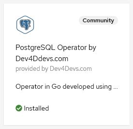
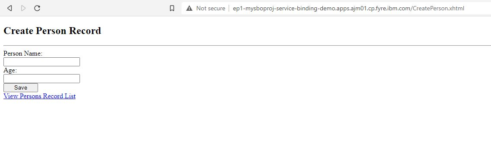

# Binding a Java Microservices JPA app to an In-cluster Operator Managed PostgreSQL Database

## Introduction

This scenario illustrates binding an odo managed Java MicroServices JPA application to an in-cluster operater managed PostgreSQL Database.

## What is odo?

odo is a CLI tool for creating applications on OpenShift and Kubernetes. odo allows developers to concentrate on creating applications without the need to administer a cluster itself. Creating deployment configurations, build configurations, service routes and other OpenShift or Kubernetes elements are all automated by odo.

Before proceeding, please [install the latest odo CLI](https://odo.dev/docs/installing-odo/)

## Actions to Perform by Users in 2 Roles

In this example there are 2 roles:

* Cluster Admin - Installs the operators to the cluster
* Application Developer - Imports a Java MicroServices JPA application, creates a DB instance, creates a request to bind the application and DB (to connect the DB and the application).

### Cluster Admin

The cluster admin needs to install 2 operators into the cluster:

* Service Binding Operator
* Backing Service Operator

A Backing Service Operator that is "bind-able," in other
words a Backing Service Operator that exposes binding information in secrets, config maps, status, and/or spec
attributes. The Backing Service Operator may represent a database or other services required by
applications. We'll use Dev4Devs PostgreSQL Operator found in the OperatorHub to
demonstrate a sample use case.

#### Install the Service Binding Operator

Navigate to the `Operators`->`OperatorHub` in the OpenShift console and in the `Developer Tools` category select the `Service Binding Operator` operator


#### Install the DB operator

Create a namespace to contain both the PostgreSQL Operator and the application that will make use of it:
```shell
> odo project create service-binding-demo
```
Access your Openshift Console and install the Dev4Devs PostgreSQL Operator from the Operator Hub:


- NOTE: Install operator into the "service-binding-demo" namespace created above

Create a database via the Dev4Devs PostgreSQL Database Operator:
Navigate to Operators > Installed Operators > PostgreSQL Operator by Dev4Ddevs.com
- Click on the 'Database Database' tab
- Click on the 'Create Database' button
- Change the value in the Database Name field to 'sampledatabase'
- Change the value in the Database User field to 'sampleuser'
- Change the value in the Database Password field to 'samplepwd'
- Click on the 'Create' button at bottom of page

Add Database connection annotations to the Database Resource Definition:
- Navigate to Operators > Installed Operators > PostgreSQL Operator by Dev4Ddevs.com
- Click on the "Database Database" tab
- Click on the new database entry in the list
- Click on the YAML tab

Add the following `annotations` mapping to the `metadata` mapping in the YAML so it looks something like:

```yaml
metadata:
  annotations:
    service.binding/db.name: 'path={.spec.databaseName}'
    service.binding/db.password: 'path={.spec.databasePassword}'
    service.binding/db.user: 'path={.spec.databaseUser}'
```
- Save the YAML
- Reload the YAML

### Application Developer

#### Login to your cluster and clone the demo JPA microservice application

In this example we will use odo to manage a sample [JPA application](https://github.com/OpenLiberty/application-stack-samples/tree/main/jpa).

First, from a terminal session log in to your OpenShift cluster with the `oc login` command, and clone the repo:

```shell
> git clone https://github.com/OpenLiberty/application-stack-samples.git
```
cd to the sample JPA app
```shell
> cd jpa
```
We assume we're still using a current namespace of "service-binding-demo" from the previous section, and go ahead and create a java-openliberty typed component using odo

```shell
> odo create java-openliberty mysboproj
```

Perform an initial odo push of the app to the cluster
```shell
> odo push 
```

You might see a delay or even something looking like an error message if the stack image needs to be pulled, so give it a bit of time.  Eventually you should see:

```
Pushing devfile component "mysboproj"
 V  Changes successfully pushed to component
```

The application is now deployed to the cluster - you can view the status of the cluster and the application test results by streaming the openshift logs to the terminal

```shell
> odo log
```
Notice the failing tests due to an UnknownDatabaseHostException:

```shell
[INFO] [err] java.net.UnknownHostException: ${DATABASE_CLUSTERIP}
[INFO] [err]    at java.base/java.net.AbstractPlainSocketImpl.connect(AbstractPlainSocketImpl.java:220)
[INFO] [err]    at java.base/java.net.SocksSocketImpl.connect(SocksSocketImpl.java:403)
[INFO] [err]    at java.base/java.net.Socket.connect(Socket.java:609)
[INFO] [err]    at org.postgresql.core.PGStream.<init>(PGStream.java:68)
[INFO] [err]    at org.postgresql.core.v3.ConnectionFactoryImpl.openConnectionImpl(ConnectionFactoryImpl.java:144)
[INFO] [err]    ... 86 more
[ERROR] Tests run: 2, Failures: 1, Errors: 1, Skipped: 0, Time elapsed: 0.706 s <<< FAILURE! - in org.example.app.it.DatabaseIT
[ERROR] testGetAllPeople  Time elapsed: 0.33 s  <<< FAILURE!
org.opentest4j.AssertionFailedError: Expected at least 2 people to be registered, but there were only: [] ==> expected: <true> but was: <false>
        at org.example.app.it.DatabaseIT.testGetAllPeople(DatabaseIT.java:57)

[ERROR] testGetPerson  Time elapsed: 0.047 s  <<< ERROR!
java.lang.NullPointerException
        at org.example.app.it.DatabaseIT.testGetPerson(DatabaseIT.java:41)

[INFO]
[INFO] Results:
[INFO]
[ERROR] Failures:
[ERROR]   DatabaseIT.testGetAllPeople:57 Expected at least 2 people to be registered, but there were only: [] ==> expected: <true> but was: <false>
[ERROR] Errors:
[ERROR]   DatabaseIT.testGetPerson:41 NullPointer
[INFO]
[ERROR] Tests run: 2, Failures: 1, Errors: 1, Skipped: 0
[INFO]
[ERROR] Integration tests failed: There are test failures.
```

You can also access the application via the openshift URL created ealier. To see the URL that was created, list it
```shell
> odo url list
```
You will see a fully formed URL that can be used in a web browser
```shell
[root@ajm01-inf jpa]# odo url list
Found the following URLs for component mysboproj
NAME     STATE      URL                                                                      PORT     SECURE     KIND
ep1      Pushed     http://ep1-mysboproj-service-binding-demo.apps.ajm01.cp.fyre.ibm.com     9080     false      route
```

Use URL to navigate to the CreatePerson.xhtml data entry page, e.g. `http://ep1-mysboproj-service-binding-demo.apps.ajm01.cp.fyre.ibm.com/CreatePerson.xhtml` and enter a user's name and age data via the form.

Click on the "Save" button when complete


Note that the entry of any data does not result in the data being displayed when you click on the "View Persons Record List" link

#### Express an intent to bind the DB and the application

Now, the only thing that remains is to connect the DB and the application. We will use odo to create a link to the Dev4Devs PostgreSQL Database Operator in order to access the database connection information.

Display the services available to odo: - You will see an entry for the PostgreSQL Database Operator displayed:

```shell
> odo catalog list services
Operators available in the cluster
NAME                                             CRDs
postgresql-operator.v0.1.1                       Backup, Database
>
```


[comment]: <> (This following block is commented out for now, it will not be included)
[comment]: <> (use odo to create an odo service for the PostgreSQL Database Operator by entering the previous result in the following format: `<NAME>/<CRDs>`)
[comment]: <> (```shell)
[comment]: <> (>  odo service create postgresql-operator.v0.1.1/Database)
[comment]: <> (```)
[comment]: <> (push this service instance to the cluster)
[comment]: <> (```shell)
[comment]: <> (> odo push)
[comment]: <> (```)


List the service associated with the database created via the PostgreSQL Operator:
```shell
> odo service list
NAME                        AGE
Database/sampledatabase     6m31s

>
```
Create a Service Binding Request between the application and the database using the Service Binding Operator service created in the previous step
`odo link` command: 

```shell
> odo link Database/sampledatabase
```

push this link to the cluster
```shell
> odo push
```

After the link has been created and pushed a secret will have been created containing the database connection data that the application requires.

You can inspect the new intermediate secret via the Openshift console in Administrator view by navigating to Workloads > Secrets and clicking on the secret named `mysboproj-database-sampledatabase` Notice it contains 4 pieces of data all related to the connection information for your PostgreSQL database instance.

Push the newly created link. This will terminate the existing application pod and start a new application pod.
```shell
odo push 
```
Once the new pod has initialized you can see the secret database connection data as it is injected into the pod environment by executing the following:
```shell
> odo exec -- bash -c 'export | grep DATABASE'
declare -x DATABASE_CLUSTERIP="172.30.36.67"
declare -x DATABASE_DB_NAME="sampledatabase"
declare -x DATABASE_DB_PASSWORD="samplepwd"
declare -x DATABASE_DB_USER="sampleuser"
```

Once the new version is up (there will be a slight delay until application is available), navigate to the CreatePerson.xhtml using the URL created in a previous step. Enter requested data and click the "Save" button


Notice you are re-directed to the PersonList.xhtml page, where your data is displayed having been input to the postgreSQL database and retrieved for display purposes.


You may inspect the database instance itself and query the table to see the data in place by using the postgreSQL command line tool, **psql** .

Navigate to the pod containing your db from the OpenShift Console

Click on the terminal tab. 

At the terminal prompt access psql for your database

```shell
sh-4.2$ psql sampledatabase
psql (12.3)
Type "help" for help.

sampledatabase=#
```

Issue the following SQL statement:

```shell
sampledatabase=# SELECT * FROM person;
```

You can see the data that appeared in the results of the test run:
```shell
 personid | age |  name   
----------+-----+---------
        5 |  52 | person1
(1 row)

sampledatabase=# 
```
